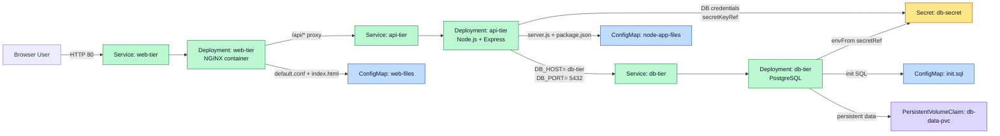

# 3-Tier Kubernetes Architecture

This project implements a simple three-tier application running in Kubernetes:

- Web tier: NGINX serving the static frontend and proxying API traffic
- API tier: Node.js + Express application that exposes the business logic
- Database tier: PostgreSQL storing application data

The architecture is intentionally split into separate Deployments and Services so each layer can scale, update, and manage its own configuration independently.

## High-Level Overview

The application flow is:

1. A user accesses the web frontend through the `web-tier` Service.
2. NGINX serves the static HTML page and forwards `/api/*` requests to the `api-tier` Service.
3. The Node.js API connects to PostgreSQL on the `db-tier` Service.
4. PostgreSQL persists data to a PVC and initializes schema/data from a ConfigMap.

```mermaid
flowchart LR
    User[Browser / Client] -->|HTTPS or HTTP on port 80| WebSvc[Service: web-tier]
    WebSvc --> WebPod[Deployment: web-tier\nNGINX frontend]
    WebPod -->|serves static page| BrowserUI[Frontend HTML + JS]
    WebPod -->|proxy /api/*| ApiSvc[Service: api-tier]
    ApiSvc --> ApiPod[Deployment: api-tier\nNode.js + Express API]
    ApiPod -->|reads env vars| DbSecret[Secret: db-secret]
    ApiPod -->|connects to database| DbSvc[Service: db-tier]
    DbSvc --> DbPod[Deployment: db-tier\nPostgreSQL]
    DbPod -->|mounts data volume| PVC[PersistentVolumeClaim: db-data-pvc]
    DbPod -->|initializes schema| InitCM[ConfigMap: init.sql]
    WebPod -->|loads config files| WebCM[ConfigMap: web-files]
    ApiPod -->|loads app files| ApiCM[ConfigMap: node-app-files]

    classDef secret fill:#fde68a,stroke:#b45309,color:#111827;
    classDef config fill:#bfdbfe,stroke:#1d4ed8,color:#111827;
    classDef app fill:#bbf7d0,stroke:#15803d,color:#111827;
    classDef data fill:#ddd6fe,stroke:#6d28d9,color:#111827;

    class DbSecret secret;
    class WebCM,ApiCM,InitCM config;
    class User,BrowserUI,WebSvc,WebPod,ApiSvc,ApiPod,DbSvc,DbPod app;
    class PVC data;
```

## Resource Layout

### 1. Web Tier

- Deployment: `web-tier`
- Service: `web-tier`
- Image: `nginx:1.25.2-alpine`
- Port: `80`

Responsibilities:
- Serve the frontend HTML page from `/usr/share/nginx/html`
- Load the NGINX configuration from a ConfigMap
- Reverse proxy `/api/` requests to `http://api-tier:3000/`

Key configuration:
- `web-files` ConfigMap provides:
  - `index.html`
  - `default.conf`
- The init container copies the ConfigMap content into writable emptyDir volumes before the main NGINX container starts.

### 2. API Tier

- Deployment: `api-tier`
- Service: `api-tier`
- Image: `node:20-bullseye-slim`
- Port: `3000`

Responsibilities:
- Run an Express API that exposes task CRUD endpoints
- Connect to PostgreSQL using environment variables
- Load application files from a ConfigMap into the runtime filesystem

Key configuration:
- `node-app-files` ConfigMap contains:
  - `package.json`
  - `server.js`
- An init container copies the app files from the ConfigMap into an `emptyDir` volume so the runtime container can execute them.

### 3. Database Tier

- Deployment: `db-tier`
- Service: `db-tier`
- Image: `postgres:13`
- Port: `5432`
- Persistent volume: `db-data-pvc`

Responsibilities:
- Run PostgreSQL as the backing data store
- Initialize the database schema and initial seed data
- Persist database files across restarts with a PVC

Key configuration:
- `db-secret` Secret stores the database credentials
- `init.sql` ConfigMap mounts into `/docker-entrypoint-initdb.d` to initialize the database when the container starts
- `db-data-pvc` stores PostgreSQL data under `/var/lib/postgresql/data`

## How Environment Variables and Secrets Are Handled

### Secret injection

The project uses a Kubernetes `Secret` named `db-secret`:

- `POSTGRES_DB`
- `POSTGRES_USER`
- `POSTGRES_PASSWORD`

This Secret is used in two ways:

1. API tier injection
   - `DB_NAME`, `DB_USER`, and `DB_PASSWORD` are populated from `secretKeyRef`.
   - `DB_HOST` and `DB_PORT` are set directly as plain environment variables.
   - This allows the Node application to connect to PostgreSQL without hardcoding credentials in the code.

2. Database tier injection
   - The PostgreSQL container uses `envFrom` with `secretRef: db-secret`.
   - This passes the secret values into the PostgreSQL container as environment variables, which PostgreSQL uses for the initial superuser and DB configuration.

### ConfigMap usage

Configuration and application files are stored in ConfigMaps instead of embedding them directly in the containers:

- `web-files` ConfigMap:
  - NGINX config (`default.conf`)
  - Frontend page (`index.html`)
- `node-app-files` ConfigMap:
  - Node app manifest (`package.json`)
  - Server code (`server.js`)
- `init.sql` ConfigMap:
  - Initialization SQL for creating the `tasks` table and seeding data

This pattern keeps application content and runtime configuration separate from the deployment manifests and makes updates easier to manage.

## Connection Flow

- The browser connects to `web-tier` on port `80`.
- NGINX serves the static frontend and handles `/api/` requests.
- The frontend makes requests like `/api/tasks` and `/api/tasks/:id`.
- NGINX proxy-passes these requests to `api-tier:3000`.
- The Node API reads DB connection values from environment variables.
- The API connects to the PostgreSQL service at `db-tier:5432`.
- PostgreSQL reads credentials from the Secret and writes persistent data to the PVC.

## Deployment Relationships

## Security and Configuration Notes

- Secrets are not stored in plain text in the application source code.
- Credentials are injected at runtime via Kubernetes `Secret` objects.
- Application and HTML files are versioned as ConfigMaps rather than baked into the images.
- PostgreSQL data persists beyond pod restarts because it is mounted from a PVC.

## Summary

This project demonstrates a standard Kubernetes pattern where:

- Services provide stable networking between tiers
- Deployments manage the application containers
- ConfigMaps hold non-sensitive configuration and file content
- Secrets provide sensitive data such as database credentials
- PVCs provide persistence for stateful workloads such as PostgreSQL

The result is a clean separation of concerns between the frontend, application logic, and database storage, while keeping environment configuration centralized and manageable.
